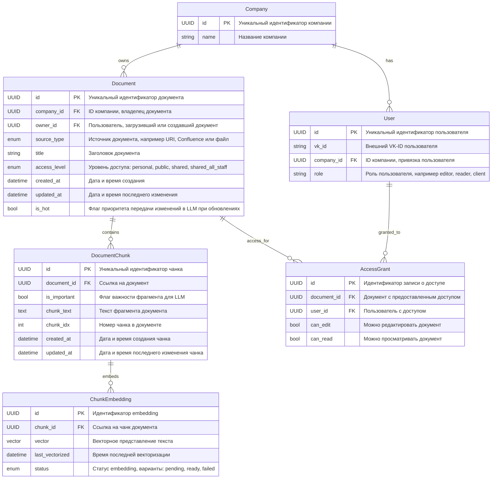

```mermaid
erDiagram
    Company {
            UUID id PK "Уникальный идентификатор компании"
            string name "Название компании"
    }
    User {
            UUID id PK "Уникальный идентификатор пользователя"
            string vk_id "Внешний VK-ID пользователя"
            UUID company_id FK "ID компании, привязка пользователя"
            string role "Роль пользователя, например editor, reader, client"
    }
    Document {
            UUID id PK "Уникальный идентификатор документа"
            UUID company_id FK "ID компании, владелец документа"
            UUID owner_id FK "Пользователь, загрузивший или создавший документ"
            enum source_type "Источник документа, например URI, Confluence или файл"
            string title "Заголовок документа"
            enum access_level "Уровень доступа: personal, public, shared, shared_all_staff"
            datetime created_at "Дата и время создания"
            datetime updated_at "Дата и время последнего изменения"
            bool is_hot "Флаг приоритета передачи изменений в LLM при обновлениях"
    }
    DocumentChunk {
            UUID id PK "Уникальный идентификатор чанка"
            UUID document_id FK "Ссылка на документ"
            bool is_important "Флаг важности фрагмента для LLM"
            text chunk_text "Текст фрагмента документа"
            int chunk_idx "Номер чанка в документе"
            datetime created_at "Дата и время создания чанка"
            datetime updated_at "Дата и время последнего изменения чанка"
    }
    ChunkEmbedding {
            UUID id PK "Идентификатор embedding"
            UUID chunk_id FK "Ссылка на чанк документа"
            vector vector "Векторное представление текста"
            datetime last_vectorized "Время последней векторизации"
            enum status "Статус embedding, варианты: pending, ready, failed"
    }
    AccessGrant {
            UUID id PK "Идентификатор записи о доступе"
            UUID document_id FK "Документ с предоставленным доступом"
            UUID user_id FK "Пользователь с доступом"
            bool can_edit "Можно редактировать документ"
            bool can_read "Можно просматривать документ"
    }
    
    Company ||--o{ User : has
    Company ||--o{ Document : owns
    Document ||--o{ DocumentChunk : contains
    DocumentChunk ||--o{ ChunkEmbedding : embeds
    Document ||--o{ AccessGrant : access_for
    User ||--o{ AccessGrant : granted_to
```
