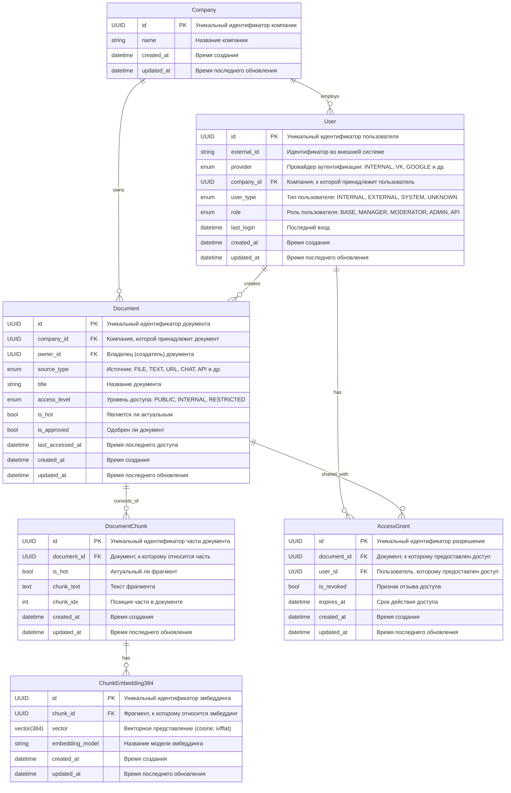

# ER Diagram

Ниже представлена актуальная структура моделей и связей в базе данных (обновлено: 13.07.2025).

```mermaid
erDiagram

    %% Компании
    Company {
        UUID id PK "Уникальный идентификатор компании"
        string name "Название компании"
        datetime created_at "Время создания"
        datetime updated_at "Время последнего обновления"
    }

    %% Пользователи
    User {
        UUID id PK "Уникальный идентификатор пользователя"
        string external_id "Идентификатор во внешней системе"
        enum provider "Провайдер аутентификации: INTERNAL, VK, GOOGLE и др."
        UUID company_id FK "Компания, к которой принадлежит пользователь"
        enum user_type "Тип пользователя: INTERNAL, EXTERNAL, SYSTEM, UNKNOWN"
        enum role "Роль пользователя: BASE, MANAGER, MODERATOR, ADMIN, API"
        datetime last_login "Последний вход"
        datetime created_at "Время создания"
        datetime updated_at "Время последнего обновления"
    }

    %% Документы
    Document {
        UUID id PK "Уникальный идентификатор документа"
        UUID company_id FK "Компания, которой принадлежит документ"
        UUID owner_id FK "Владелец (создатель) документа"
        enum source_type "Источник: FILE, TEXT, URL, CHAT, API и др."
        string title "Название документа"
        enum access_level "Уровень доступа: PUBLIC, INTERNAL, RESTRICTED"
        bool is_hot "Является ли актуальным"
        bool is_approved "Одобрен ли документ"
        datetime last_accessed_at "Время последнего доступа"
        datetime created_at "Время создания"
        datetime updated_at "Время последнего обновления"
    }

    %% Части документа
    DocumentChunk {
        UUID id PK "Уникальный идентификатор части документа"
        UUID document_id FK "Документ, к которому относится часть"
        bool is_hot "Актуальный ли фрагмент"
        text chunk_text "Текст фрагмента"
        int chunk_idx "Позиция части в документе"
        datetime created_at "Время создания"
        datetime updated_at "Время последнего обновления"
    }

    %% Эмбеддинги
    ChunkEmbedding384 {
        UUID id PK "Уникальный идентификатор эмбеддинга"
        UUID chunk_id FK "Фрагмент, к которому относится эмбеддинг"
        vector(384) vector "Векторное представление (cosine; ivfflat)"
        string embedding_model "Название модели эмбеддинга"
        datetime created_at "Время создания"
        datetime updated_at "Время последнего обновления"
    }

    %% Доступы
    AccessGrant {
        UUID id PK "Уникальный идентификатор разрешения"
        UUID document_id FK "Документ, к которому предоставлен доступ"
        UUID user_id FK "Пользователь, которому предоставлен доступ"
        bool is_revoked "Признак отзыва доступа"
        datetime expires_at "Срок действия доступа"
        datetime created_at "Время создания"
        datetime updated_at "Время последнего обновления"
    }

    %% СВЯЗИ

    Company ||--o{ User : employs
    Company ||--o{ Document : owns
    User ||--o{ Document : creates
    User ||--o{ AccessGrant : has
    Document ||--o{ DocumentChunk : consists_of
    DocumentChunk ||--o{ ChunkEmbedding384 : has
    Document ||--o{ AccessGrant : shared_with
```
